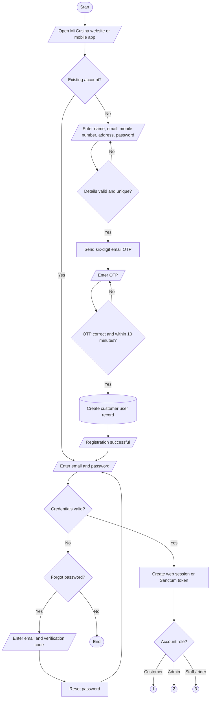
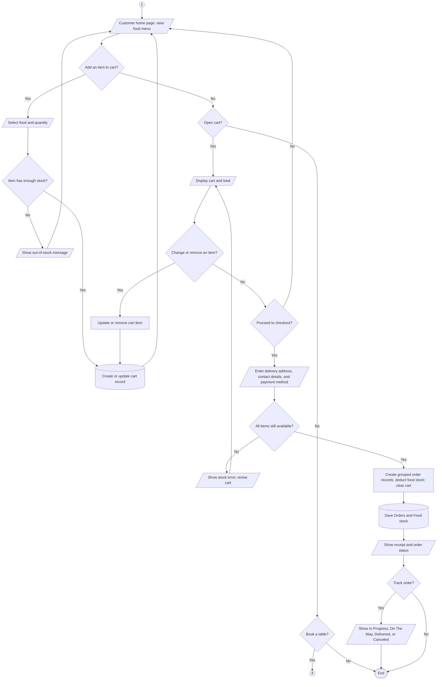
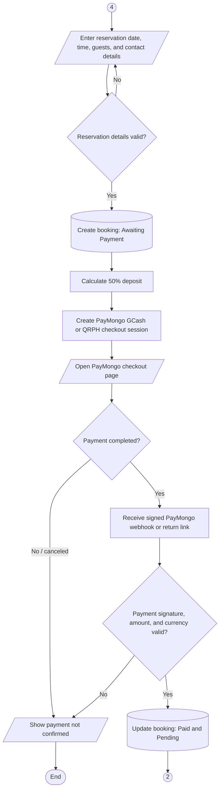
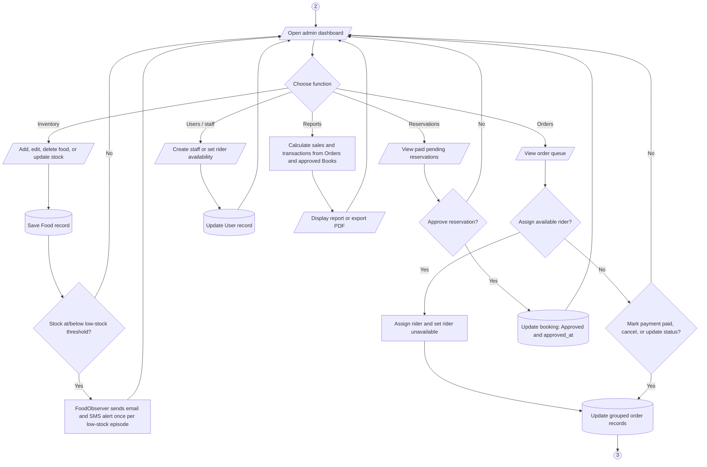
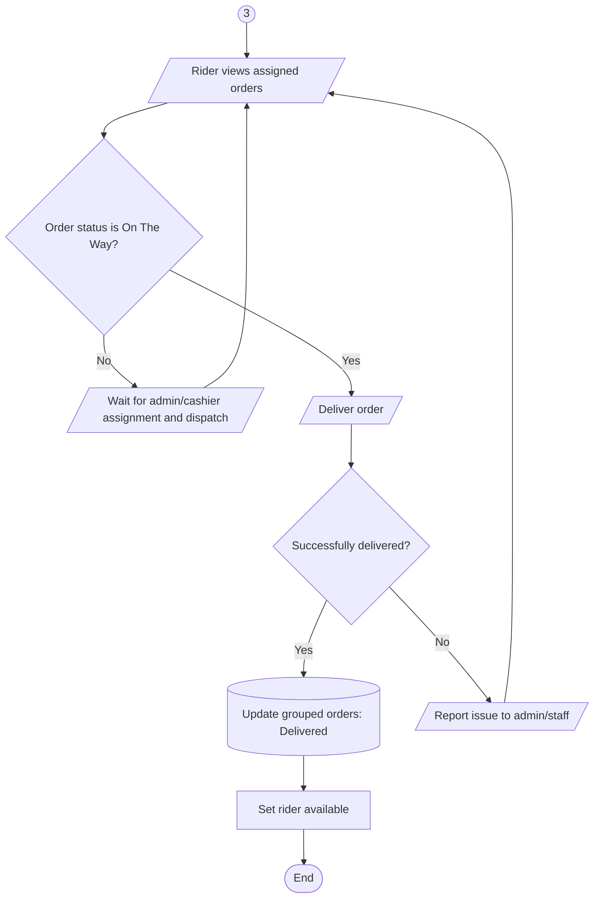
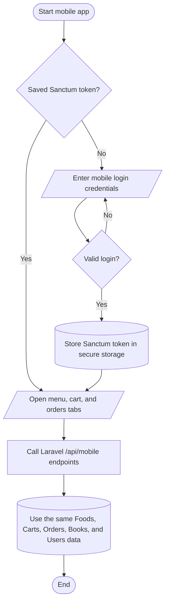

# Mi Cusina traditional system flowchart

This is a symbol-based flowchart modeled on the supplied example.

**Symbol key:** oval = Start/End; parallelogram = input/output; rectangle = process; diamond = decision; cylinder = stored record; circle = connector to another part of the chart.

## 1. Entry, login, and registration

## 2. Customer menu, cart, checkout, and tracking

## 3. Table reservation and PayMongo payment

## 4. Admin and staff operations

## 5. Rider delivery completion

## 6. Mobile-app route

