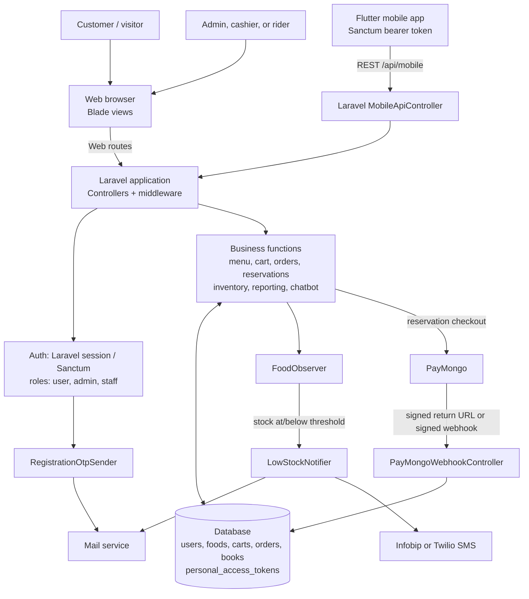
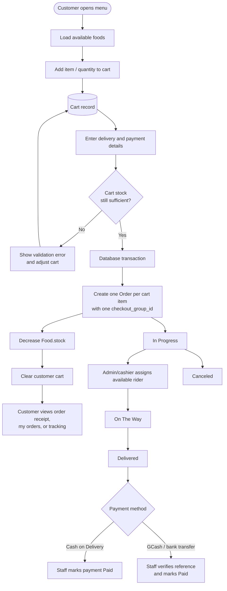
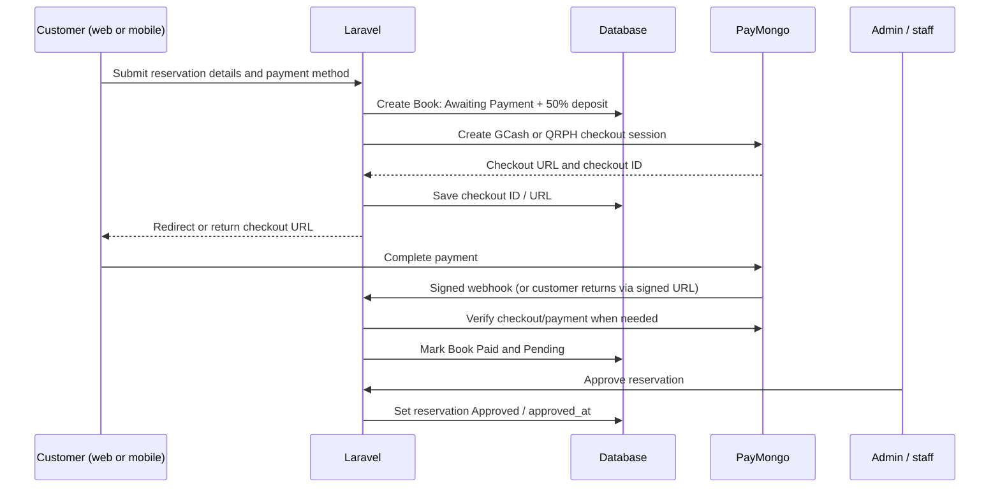
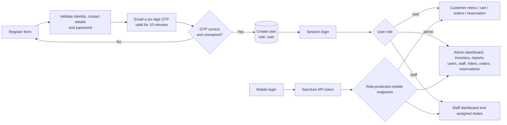
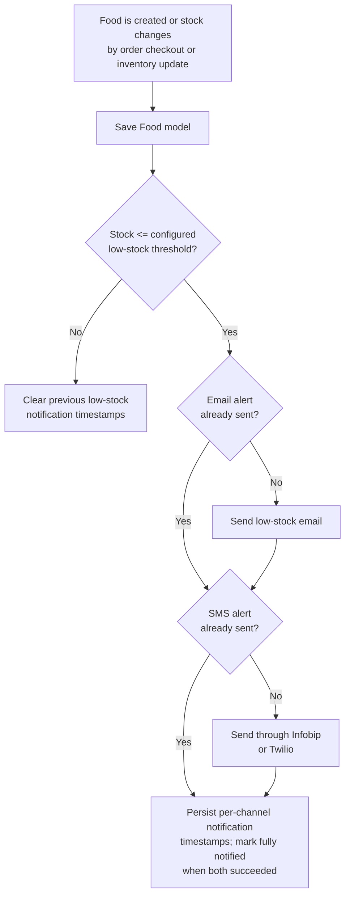
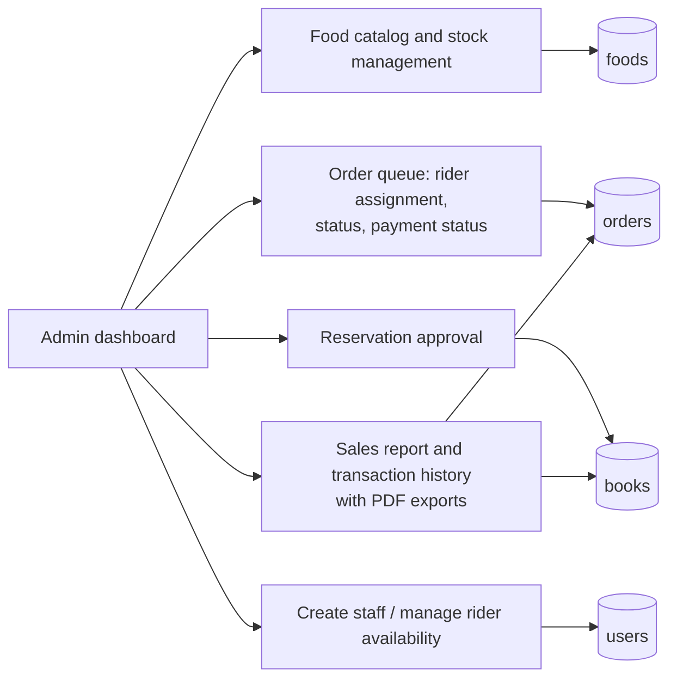
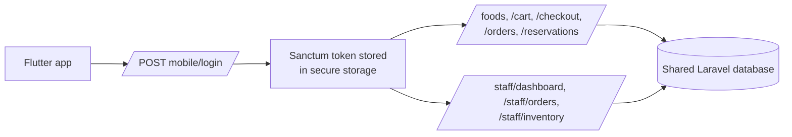

# Mi Cusina system flowchart

This diagram reflects the implemented Laravel web application, its Flutter mobile client, the shared database, and the external services it calls. Paste the Mermaid blocks into a Mermaid-compatible Markdown preview (GitHub, GitLab, Mermaid Live Editor, or VS Code Mermaid extension) to render them.

## Overall architecture

## Customer ordering flow

## Reservation and online-payment flow

## Authentication and role routing

## Inventory alert flow

## Administrative reporting and operations

## Mobile API surface

### Main state values

- Orders: `In Progress` -> `On The Way` -> `Delivered`, or `Canceled`; payment is tracked independently (`Unpaid`, `Pending Verification`, or `Paid`).
- Reservations: `Awaiting Payment` -> `Paid` + `Pending` -> `Approved` after staff review.
- Food alerts: alerts are sent once per low-stock episode and reset after stock rises above the configured threshold.
